# Global Sales Visualization

An end-to-end exploratory data analysis of a global retail sales dataset covering 5,000 transactions across 5 regions, 5 product categories, 3 customer segments, and 3 sales channels (2021–2024). I used Python for data generation, analysis, and static visualizations, and Tableau for interactive dashboards.

---

## Tools & Libraries

| Tool | Purpose |
|---|---|
| Python (Pandas) | Data wrangling, aggregation, statistical analysis |
| Python (Matplotlib) | Static charts and visualizations |
| Tableau Public | Interactive dashboard and storytelling |

---

## Dataset

Generated synthetically using `numpy` and `pandas` with realistic distributions:

- **5,000** transactions from January 2021 to December 2024
- **Regions:** North America, Europe, Asia-Pacific, Latin America, Middle East & Africa
- **Categories:** Electronics, Clothing, Food & Beverage, Home & Garden, Sports & Outdoors
- **Segments:** Consumer, Corporate, Home Office
- **Channels:** Online, In-Store, Mobile App
- **Features:** unit price, quantity, discount rate, revenue, profit, profit margin

---

## Matplotlib Visualizations

### 1. Annual Revenue Trend

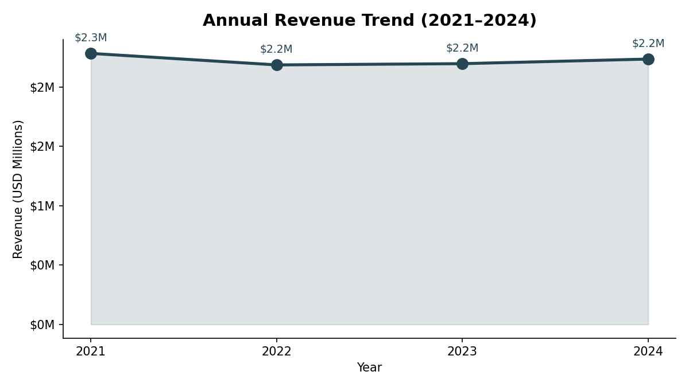

**Why this chart:** A line chart with a shaded area is the clearest way to show a continuous metric over time. I wanted to immediately see the trajectory — whether the business was growing, declining, or plateauing.

**What I found:** Revenue peaked at $2.28M in 2021, dropped -3.95% in 2022, then slowly recovered to $2.23M by 2024. The overall CAGR is -0.7%, pointing to a near-flat growth period rather than a contraction. The recovery trend from 2022 onward is a positive signal.

---

### 2. Revenue by Region

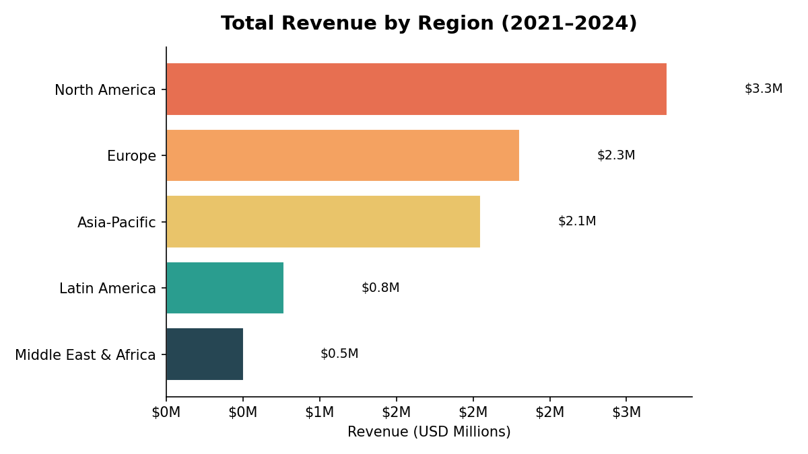

**Why this chart:** A horizontal bar chart makes it easy to compare values across categories, especially when the labels are long. Sorting by value makes the ranking immediately clear.

**What I found:** North America leads at $3.3M (37% of total), followed by Europe at $2.3M. Together they account for 63% of global revenue. Middle East & Africa sits at just $0.5M — significantly underpenetrated compared to its potential. Latin America at $0.8M also shows room to grow.

---

### 3. Revenue Share by Product Category

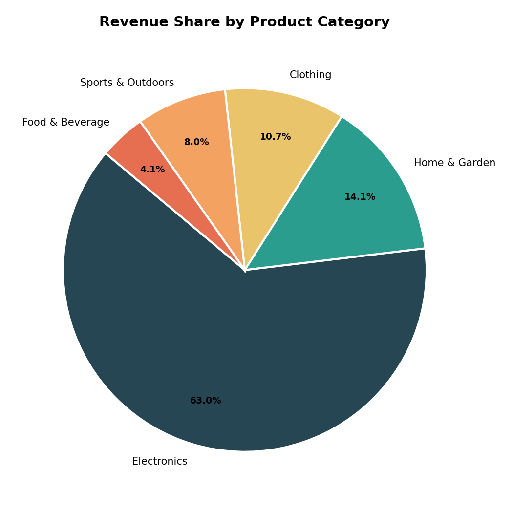

**Why this chart:** A pie chart works well here because I'm looking at part-to-whole relationships across a small number of categories (5). It makes the dominance of one category visually striking.

**What I found:** Electronics alone accounts for 63% of total revenue, driven entirely by its high base unit price ($450 avg). Food & Beverage has the smallest share at just 4.1%. This level of concentration in one category is a risk — any supply chain or demand shift in Electronics would heavily impact overall performance.

---

### 4. Monthly Revenue Heatmap

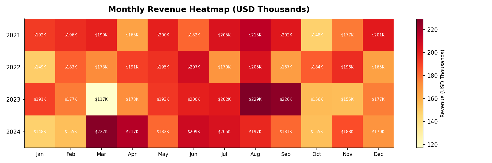

**Why this chart:** A heatmap lets me look at two dimensions simultaneously — month and year — and spot patterns that a line chart would hide. The color intensity immediately draws the eye to peaks and troughs.

**What I found:** August and September 2023 were the top months ($229K and $226K). October is the weakest month in every single year — a recurring seasonal pattern. March 2024 shows an unexpected spike ($227K) that breaks the usual pattern and stands out as worth investigating.

---

### 5. Profit Margin Distribution by Category

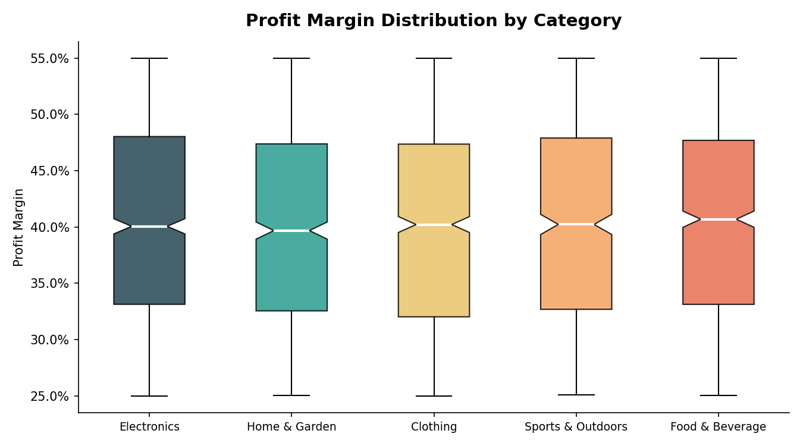

**Why this chart:** Box plots show distribution shape, spread, and outliers all at once. I chose this over a simple bar chart because I wanted to understand the variability of margins, not just the average.

**What I found:** All five categories cluster around a median margin of ~40% with an IQR of roughly 32–48%. The margins are strikingly uniform across categories — there's no category that commands a premium margin. Electronics has the widest spread, reflecting its broader price range.

---

### 6. Revenue by Region and Sales Channel

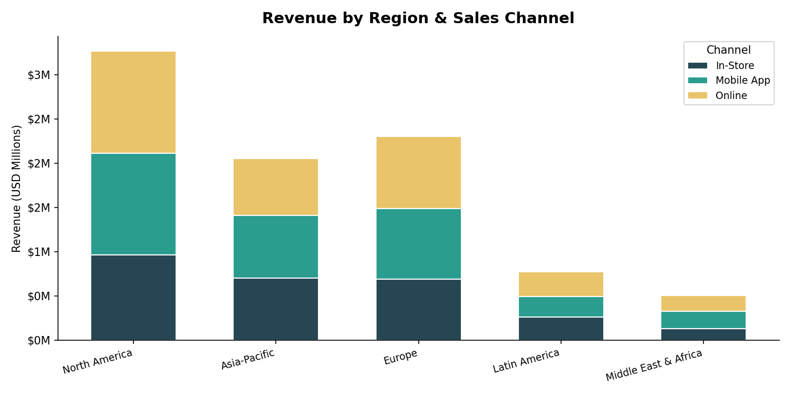

**Why this chart:** A stacked bar chart shows both the total per region and the composition by channel in one view. This is more informative than separate charts for each dimension.

**What I found:** Mobile App is the top revenue channel in every region, consistently outperforming both Online and In-Store. This holds true across both large markets (North America) and small ones (Middle East & Africa). The shift to mobile commerce is clearly not region-specific — it's a global pattern.

---

### 7. Discount Rate vs. Profit Margin

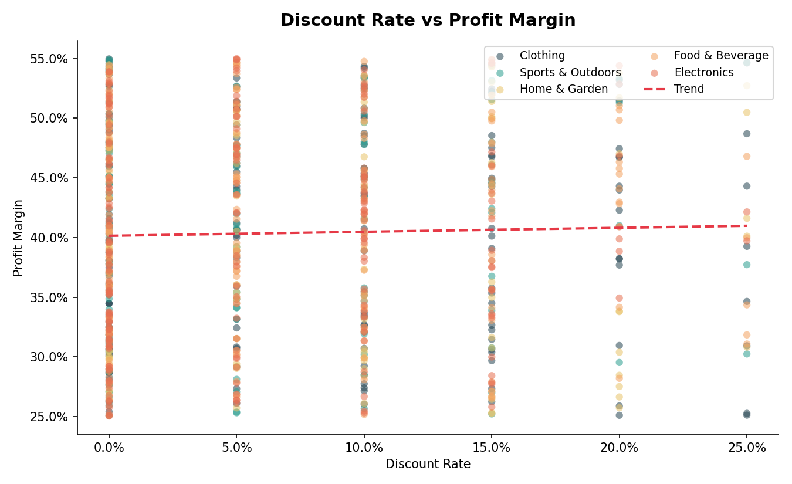

**Why this chart:** A scatter plot is the right tool to explore the relationship between two continuous variables. I added a trend line to quantify the direction and strength of the relationship.

**What I found:** The trend line is nearly flat (Pearson r = 0.01). Discounts ranging from 0% to 25% have virtually no effect on profit margin. This tells me the cost base adjusts proportionally with the selling price — the business is pricing based on a fixed cost-plus model. Offering deeper discounts is not hurting margins, but it's also not driving efficiency gains.

---

### 8. Quarterly Revenue Year-over-Year

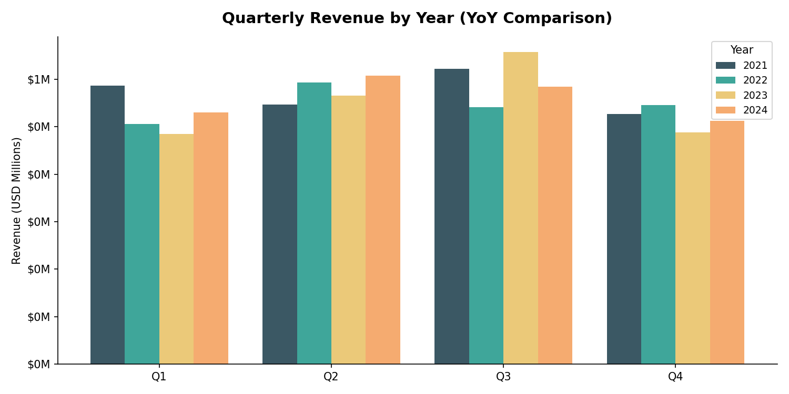

**Why this chart:** A grouped bar chart is perfect for comparing the same time period across multiple years. It makes year-over-year differences jump out while preserving the quarterly structure.

**What I found:** Q3 is consistently the strongest quarter every year — the pattern is remarkably stable. Q1 2021 was an outlier peak that hasn't been repeated. Revenue distribution across quarters became more balanced in 2022–2024, suggesting the business has reduced its dependence on any single quarter.

---

## Pandas Analysis

### Monthly Revenue and Profit Trend

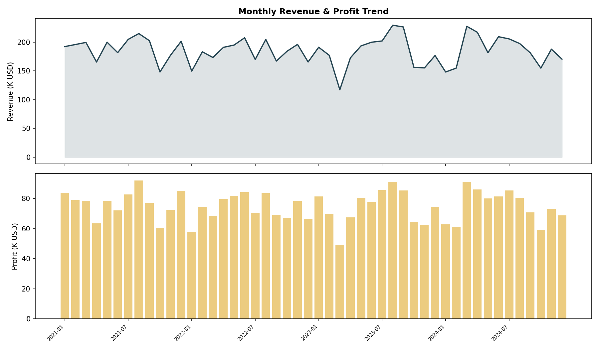

**Why this analysis:** I wanted to look at both revenue and profit together on a monthly basis to see if they move in sync or diverge at any point.

**What I found:** Revenue and profit move together closely, confirming stable margins throughout the period. There are no months where profit diverged sharply from revenue, reinforcing the finding that margins are cost-driven and consistent.

---

### Revenue by Region and Category (Pivot Table)

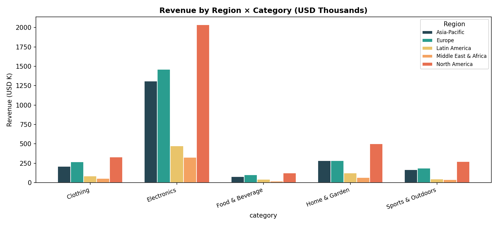

**Why this analysis:** A pivot table gives a comprehensive cross-sectional view that no single chart can provide. Grouping by both region and category reveals which combinations drive the most value.

**What I found:** North America Electronics ($2,036K) is the single largest cell — more than double any other combination. Every region follows the same category ranking: Electronics leads everywhere. Food & Beverage is the weakest in all five regions.

---

### Customer Segment Profitability

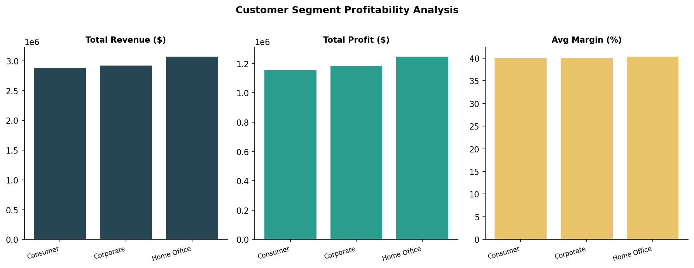

**Why this analysis:** Understanding which customer type generates the most value per transaction is critical for targeting and retention strategy.

**What I found:** All three segments contribute roughly equal total revenue (~$2.9M each), but Home Office has the highest average order value ($1,831) and the best average margin (40.4%). Consumer has the most orders (1,631) but the lowest margin — more transactions, less value per transaction.

---

### Discount Impact on Margin

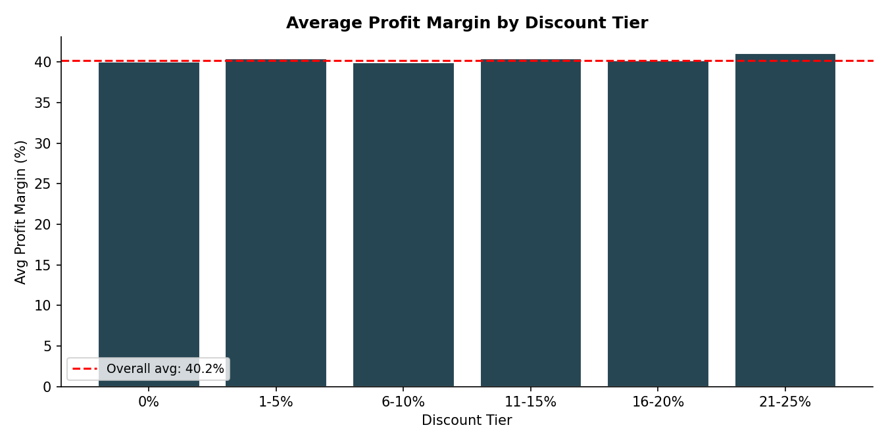

**Why this analysis:** I built discount tiers to bucket orders and compare average margins across groups. This is a more structured way to test the discount-margin relationship than a scatter plot alone.

**What I found:** Every tier from 0% to 25% discount sits within a fraction of a percent of the 40% average margin line. The bar chart makes it visually undeniable — there is no discount tier that underperforms. This is a strong finding for pricing strategy.

---

### Correlation Matrix

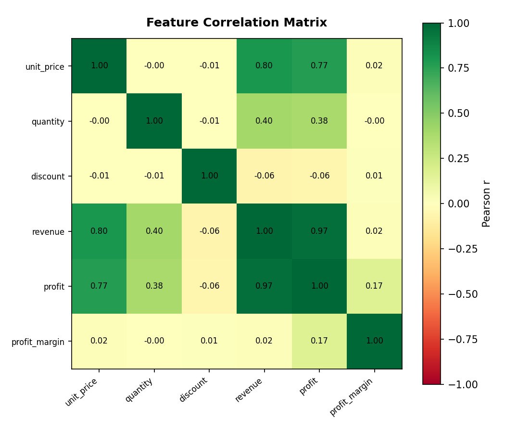

**Why this analysis:** A correlation matrix gives a bird's-eye view of how all numeric features relate to each other. I used this to identify which variables are worth investigating as revenue and profit drivers.

**What I found:** Unit price is the strongest predictor of revenue (r = 0.80) — far more impactful than quantity (r = 0.40). Revenue and profit are tightly correlated (r = 0.97). Discount is effectively independent of everything else (max r = 0.01), confirming it plays no structural role in profit outcomes.

---

## Tableau Dashboard

I built an interactive version of this analysis on Tableau Public. The dashboard includes five views with cross-filtering:

- **Revenue Trend** — monthly line chart by year
- **Category Revenue** — horizontal bar chart
- **Region Profit** — profit by geography
- **Discount vs Margin** — scatter with trend lines per category
- **Margin Heatmap** — region by category with margin values

**View the live dashboard here:**
[Retail Sales Analytics on Tableau Public](https://public.tableau.com/app/profile/anees.saheba.guddi/viz/RetailSalesAnalysis_17726585418550/RetailSalesAnalytics)

[](https://public.tableau.com/app/profile/anees.saheba.guddi/viz/RetailSalesAnalysis_17726585418550/RetailSalesAnalytics)

---

## Key Findings Summary

| # | Finding |
|---|---|
| 1 | Revenue declined -3.95% in 2022 but has been recovering; CAGR of -0.7% overall |
| 2 | North America (37%) and Europe (26%) together generate 63% of all revenue |
| 3 | Electronics accounts for 63% of revenue — a concentration risk worth monitoring |
| 4 | Q3 is the peak quarter every year; October is consistently the weakest month |
| 5 | Profit margin is stable at ~40% across all categories, segments, and discount tiers |
| 6 | Discounts have no measurable effect on profit margin (Pearson r = 0.01) |
| 7 | Unit price is the strongest revenue driver (r = 0.80) — pricing matters more than volume |
| 8 | Mobile App is the top sales channel in every region and segment |
| 9 | Home Office segment has the highest average order value ($1,831) and best margin |

---

## Repository Structure

```
global-sales-visualization-tableau/
├── retail_sales_analysis.ipynb   # Full analysis notebook
├── retail_sales.csv              # Generated dataset
├── matplotlib_figures/           # Static charts (Matplotlib)
├── pandas_figures/               # Analysis charts (Pandas)
└── tableau_exports/              # CSVs exported for Tableau
```

---

## How to Run

```bash
pip install numpy pandas matplotlib
jupyter notebook retail_sales_analysis.ipynb
```

Run all cells top to bottom. The dataset is generated in the first cell so no external data download is needed.
